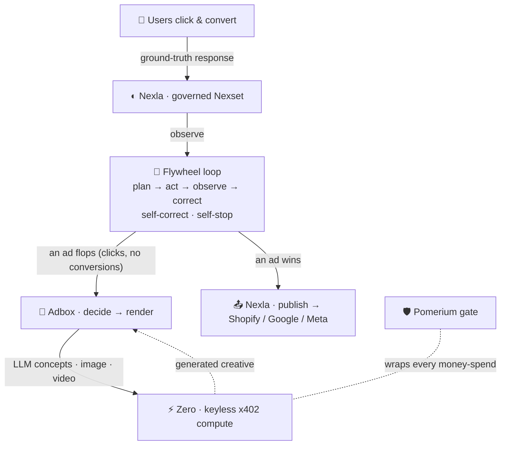

# 🔁 Flywheel — self-improving ads

**Ads that rewrite themselves to fit your users.** An agent loop watches how users respond to each
ad, keeps the winners, and **regenerates the ads users ignore** — the concept, the image, and the
video — then ships the champion to every ad platform. Keyless compute on **Zero**, governed data on
**Nexla**, measured live.

> One loop engine. Ground-truth feedback the agent can't fake. Self-correcting, self-stopping.
> Adbox's creative factory is the hands; the loop is the brain; Zero + Nexla are the engines.

---

## ✨ The idea

Most "AI ad" tools generate a campaign once and stop — they render and walk away. Flywheel closes
the loop:

1. **Observe** real user response (clicks → conversions) as a **governed Nexla Nexset**.
2. **Diagnose** each ad. Two failure modes, two different fixes: *bid too low* → spend more;
   *creative doesn't resonate* → make a new one.
3. **Regenerate** the losing creative — draft concepts, render an image, animate a video — all
   discovered and paid for **keylessly through Zero** (x402).
4. **Publish** the winning ad to Shopify / Google / Meta as a **governed Nexla pipeline**.

The same generic loop engine (`loopkit`) also drives a second domain (recruiting) unchanged — proof
it's real loop engineering, not a chatbot in a trench coat.

---

## 🏗️ Architecture



- **Nexla** = the data plane, both directions (user-response data **in**, winning campaign **out**).
- **Zero** = keyless, pay-per-use compute (LLM + image + video), replacing Akamai.
- **Adbox** = the "decide → render" creative factory.
- **Flywheel** = the loop that measures response and self-corrects.
- **Pomerium** = an infra-layer gate on every spend (budget cap, approval, injection blocked, audit).

---

## 🔌 How each sponsor is used (their core capability)

| Sponsor | Role | Capability used |
|---|---|---|
| **Nexla** | user-response data **in** + campaign **out** | governed Nexsets + connectors (Shopify/Google/Meta), MCP toolset |
| **Zero** | the whole compute stack | keyless API discovery + **x402 micropayments** — LLM, image, video |
| **Adbox** | creative engine | two-tier *decide → render* (re-architected off Akamai) |
| **Pomerium** | security | policy-gated spend; prompt-injection blocked at the infra layer |

### Live models (all paid from the Zero wallet, no keys, settled via **mpp on Tempo**)

| Step | Model (via Zero) | Cost |
|---|---|---|
| Decide — concepts | `Groq · Llama 3.3 70B` | ~$0.008 |
| Render — image | `fal.ai · FLUX.1 Schnell` | $0.003 |
| Render — hero video | `Grok Imagine · image→video` | $0.50 |
| Publish — hosting | `Zero · Host Website` | free |

Every generation is fresh (unique seed, context-aware prompt from the ad's user-response problem),
and every step **falls back to a prebuilt creative** if a paid call fails — the loop never stalls.

---

## 🚀 Quick start (zero dependencies)

The core is pure Python stdlib — no `pip install`, no API keys needed to run the demo.

```bash
py -m dashboard.server        # then open http://localhost:8000
```

Click **▶ Start**, then **💀 Make an ad flop** to watch the agent draft a live concept and render a
new ad; when an ad wins, it generates a hero video and publishes. **ⓘ How it works** (`/about`)
explains the whole architecture with a diagram.

Faster demo pace: `FLYWHEEL_PERIOD_DELAY=0.6 py -m dashboard.server`

Headless sanity check (no UI): `py run_headless.py 15`

> Uses the Windows Python launcher `py`. On macOS/Linux use `python3`.

---

## 🎛️ The dashboard

A dark, minimal, single-page app (no scrolling log feeds):

- **The ad, right now** — the featured ad's creative (image / generated video), before → after.
- **User response** — the one headline metric (conversions per $) + a sparkline + a 4-dot loop pulse.
- **Your ads, learning** — the population of ads; weak ones flag "needs new creative," winners flag 🏆.
- **Cost ledger** — real x402 spend, itemized live.
- **Badges** — Nexla · Zero · Pomerium light up as each engine works.
- Scenario buttons drive the demo beats: make an ad flop, inject a $10k prompt-injection (blocked by
  Pomerium), a competitor bid war, force the growth handoff, and swap **Sim ↔ Replay** (a real 12-month
  campaign CSV runs the same loop).

---

## 🔑 Going live (all credentials are CLI-minted — no hand-pasted keys)

Nothing is required to run the demo. To light up the live integrations:

```bash
zero auth agent register            # Zero — keyless wallet (already used for compute)
zero wallet fund                    # optional: top up USDC for paid generation
nexla-cli login --service-key <k>   # Nexla — governed Nexset + publish (key from express.dev)
ant auth login                      # (optional) Claude as the corrector, via the ant CLI
py -m integrations.status           # shows what's authed + the CLI to auth the rest
```

The clients pick these up automatically. Copy `.env.example` → `.env` for optional tuning knobs
(`.env` is gitignored).

---

## 🧪 Tests

```bash
py -m pytest tests/ -q
```

Covers: four events per period, oscillation → halt-with-reason, one engine running two unrelated
plugins (generality), the marketing curve bending down, the Pomerium injection block, the Adbox
decide→render studio, the Nexla publish feeds, and replay determinism.

---

## 🗂️ Project layout

```
loopkit/         domain-agnostic loop engine — core, events, detectors, budget
plugins/         marketing.py (Loop A / ads), talent.py (Loop B / recruiting)
sim/             market.py (ground-truth simulator), talent.py, replay.py (12-mo CSV)
integrations/
  zero.py          Zero CLI wrapper (search / get / fetch / review)
  zero_llm.py      Zero-brokered LLM (Groq, x402) — replaces Akamai
  studio.py        Adbox decide→render on Zero (concepts → image → video)
  creative.py      relevance-limited → creative discovery, image extraction
  nexla_mcp.py     governed user-response Nexset (in)
  nexla_publish.py winning campaign → Shopify/Google/Meta feeds (out)
  pomerium.py      policy gate (budget cap / approval / injection block / audit)
  anthropic_llm.py Claude corrector via the ant CLI (optional)
  fillmore.py      Loop B outreach (stub)
dashboard/       stdlib SSE server + dark single-page UI + /about diagram
deploy/          pomerium/config.yaml (real gateway) + notes
data/            campaign_12mo.csv (historical replay)
tests/           acceptance tests
SPEC.md  DEMO.md  README.md
```

---

## 🧠 The loop engine (`loopkit`)

A tiny, dependency-free library. Everything else is a plugin implementing four steps
(`plan → act → observe → correct`). Guarantees:

- **Four events every cycle** on an event bus (if a correction isn't on screen, it didn't happen).
- **Thrash / stop detector** — halts a keyword oscillating on noise, or the loop when the objective
  stalls, with a logged reason. The agent catching *itself*.
- **Explore/exploit budgeter** — spending to *learn* vs to *earn*, stated in every plan.
- **Reasoned corrections** — a stated cause hypothesis per adjustment, a different fix per cause.

The reward simulator has a genuine interior optimum (a winner's-curse cost curve vs a placement
benefit), so the agent must *discover* the response surface by acting — it never sees the function.

---

## ⚠️ Notes & known limitations

- **Payment rails.** The Zero welcome credit settles only via **mpp on the Tempo network**; Base-bridged
  x402 endpoints fail (`Bridge failed`). All live models are pinned to working Tempo-mpp capabilities.
- **Video generation** is the slow (~90s) / pricier ($0.50) step — it runs for the *winning* ad and is
  best-effort with a prebuilt-video fallback.
- **Nexla publish** writes real platform feed files locally now; live push to Shopify/Meta needs
  `nexla-cli login`.
- Built and tested on Windows (Python 3.13); the server is stdlib-only for maximum portability.

---

## 🎬 Demo

See [`DEMO.md`](./DEMO.md) for the 2-minute run. Full build target in [`SPEC.md`](./SPEC.md).

---

*Built for a hackathon. Creative-render assets under `dashboard/static/media/adbox/` are captured
demo output from the companion [Adbox](https://github.com/Kush614/Adbox) project.*
